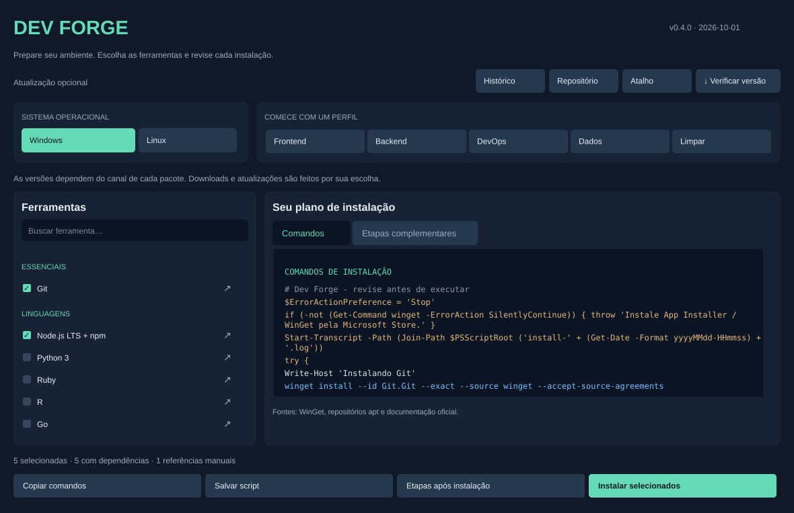

# Dev Forge

Aplicativo de desktop para preparar ambientes de desenvolvimento no Windows e no Ubuntu/Debian. Permite selecionar ferramentas, revisar comandos, exportar scripts e executar instalações em um terminal local.

Versão do projeto: **0.4.0** · Data da versão: **1 de outubro de 2026**.



Prévia ilustrada da interface v0.4.0.

[Baixar a versão mais recente](https://github.com/devheron/dev-forge/releases/latest) · [Histórico de versões](CHANGELOG.md)

## O que é instalado

O Dev Forge instala programas de desenvolvimento completos, além de utilitários de terminal. Os comandos são o meio de acionar os instaladores; o resultado depende do tipo de ferramenta selecionada.

| Tipo | Exemplos | Como usar após instalar |
| --- | --- | --- |
| Aplicativos com interface gráfica | VS Code, Arduino IDE, RStudio, Postman, VirtualBox, XAMPP | Abrir pelo menu Iniciar ou pelo menu de aplicativos, quando o instalador registra um atalho |
| Aplicativo gráfico e terminal | Docker Desktop no Windows | Abrir Docker Desktop e usar o comando docker no terminal |
| Ferramentas de terminal e runtimes | Git, Node/npm, Python, Ruby, Go, Java, kubectl, Helm, Terraform e CLIs de nuvem | Abrir um novo terminal e executar os comandos da ferramenta |
| Serviços e banco de dados | PostgreSQL, Docker Engine no Linux | Conferir o serviço e configurar seu uso; uma interface gráfica pode exigir um pacote separado |
| Ferramentas para criar projetos | Angular CLI, receita React/Vite | Criar o projeto e iniciar o servidor de desenvolvimento, depois acessar o navegador |

No Windows, os IDs WinGet das IDEs e dos aplicativos gráficos acionam seus instaladores normais. Após uma instalação bem-sucedida, procure o programa pelo nome no menu Iniciar. Um ícone na área de trabalho ou a abertura automática do aplicativo depende das opções do instalador e não é garantido. O VS Code, por exemplo, também permite abrir uma pasta com `code .` em um novo terminal. Consulte as [instruções oficiais para Windows](https://code.visualstudio.com/docs/setup/windows).

No Ubuntu/Debian, o pacote `docker.io` instala Docker Engine, sem a interface do Docker Desktop. As IDEs e alguns aplicativos gráficos estão marcados como instalação manual nesta versão: o sistema oferece suas referências oficiais, mas ainda não instala esses itens automaticamente. Após usar o instalador apropriado, o aplicativo pode ser aberto pelo menu do ambiente gráfico; formatos portáteis, como AppImage, podem precisar ser executados diretamente. Consulte também a [instalação do VS Code no Linux](https://code.visualstudio.com/docs/setup/linux).

## Por que centralizar a preparação

Preparar uma máquina costuma envolver procurar fornecedores, escolher pacotes, conferir comandos e lembrar configurações posteriores. O Dev Forge reúne essas decisões em um catálogo revisável e em perfis por atividade. Isso reduz buscas repetidas e facilita preparar outro computador ou compartilhar um plano de instalação com uma equipe.

Os scripts exportados permitem conferir o que será executado antes de alterar a máquina. As dependências básicas e as etapas complementares ajudam a evitar instalar uma ferramenta e descobrir depois que ainda falta um runtime, um serviço ou a criação do projeto. A disponibilidade dos fornecedores, a compatibilidade de versões e as etapas específicas de cada sistema continuam relevantes.

## Depois de clicar em instalar

O botão abre o terminal de instalação e a janela **Etapas após instalação**. Essa janela apresenta orientações para as ferramentas escolhidas e referências dos itens manuais. Ela também pode ser aberta pelo botão próprio na tela principal. Os scripts exportados imprimem essas orientações no terminal ao terminar as instalações automáticas.

1. Acompanhe o resultado no terminal. O aplicativo não monitora a conclusão de cada instalador; a janela de etapas não é uma confirmação de sucesso.
2. Se houver erro, resolva a causa antes de seguir. Se o instalador pedir reinicialização, conclua essa etapa.
3. Abra um novo terminal para carregar mudanças de PATH e confira as versões indicadas.
4. Abra os aplicativos gráficos instalados pelo menu do sistema.
5. Complete configurações específicas: extensões da IDE, placa e porta Arduino, serviços XAMPP/PostgreSQL, inicialização do Docker ou autenticação das CLIs.
6. Crie o projeto ou inicie o cluster conforme sua seleção. Instalar Angular CLI não cria um projeto; instalar Minikube não inicia o cluster.

As etapas informam comandos como `node --version`, `python --version`, `kubectl version --client` e `minikube start --driver=docker`, conforme as ferramentas escolhidas. Contas, senhas, placas físicas, imagens de VM e infraestrutura de nuvem exigem escolhas do usuário.

## Disponibilidade verificada

Os 23 IDs WinGet do catálogo foram encontrados nos manifests oficiais, e todos os endpoints de instaladores consultados responderam HTTP 200. Isso confirma a disponibilidade dos endereços no momento da revisão, não a instalação integral ou o funcionamento de cada aplicativo.

A auditoria não executou os instaladores e não fez uma instalação apt em Linux. Os testes automatizados verificam o comportamento do Dev Forge, não substituem testes das ferramentas instaladas. Veja a matriz e os limites em [VALIDATION.md](VALIDATION.md).

## Baixar e abrir

### Windows: download direto

[Baixar DevForge.exe para Windows x64](https://github.com/devheron/dev-forge/releases/latest/download/DevForge.exe)

1. Baixe DevForge.exe e coloque-o em uma pasta que você pretende manter.
2. Dê dois cliques no arquivo para abrir o aplicativo. Não precisa instalar Python ou extrair o código-fonte.
3. Se quiser, clique em **Atalho** para criar um ícone na área de trabalho.

O arquivo é portátil: ele abre o Dev Forge e não instala todas as ferramentas automaticamente. Você escolhe os programas depois, dentro do aplicativo. O executável ainda não possui assinatura de código; o Windows pode apresentar alertas conforme sua política de segurança.

Para instalar ferramentas no Windows, o WinGet precisa estar disponível pelo App Installer. Algumas instalações pedem administrador por UAC e podem exigir reinicialização. Recusar a solicitação cancela a execução.

### Linux: pacote portátil

[Baixar pacote Linux x64](https://github.com/devheron/dev-forge/releases/latest/download/dev-forge-linux-x64.tar.gz)

Extraia o pacote pelo gerenciador de arquivos e abra **DevForge**. Ele inclui o runtime Python. Em ambientes que exigem autorização para abrir um binário, confira a permissão de execução nas propriedades do arquivo. A abertura depende também do comportamento do gerenciador de arquivos.

O build é feito para Linux x64 com base Ubuntu 22.04. Requer ambiente gráfico e bibliotecas de sistema compatíveis; não é um binário universal para todas as distribuições. A instalação automática de ferramentas continua voltada a Ubuntu/Debian com apt e sudo. Clique em **Atalho** para adicionar o Dev Forge ao menu de aplicativos. Preserve a pasta extraída.

### Código-fonte: opção alternativa

[Baixar código-fonte](https://github.com/devheron/dev-forge/releases/latest/download/dev-forge.zip)

Esta opção é para quem prefere executar ou modificar o código. Extraia a pasta e instale Python 3.10 ou superior com Tcl/Tk.

No Windows, abra `start-windows.cmd`. No Ubuntu/Debian, instale Python/Tkinter e abra o inicializador:

```bash
sudo apt-get update
sudo apt-get install -y python3 python3-tk
bash start-linux.sh
```

O download de **Code > Download ZIP** também contém o código-fonte. Ele é independente dos downloads executáveis da página Releases.

## Uso

1. Selecione Windows ou Linux como destino.
2. Busque uma ferramenta pelo nome ou aplique um perfil: Frontend, Backend, DevOps ou Dados.
3. Confira a aba Comandos e leia as Etapas complementares.
4. Use Copiar comandos ou Salvar script para executar depois, ou Instalar selecionados para iniciar agora.

A interface reorganiza os painéis e os botões ao reduzir a janela. A lista e as prévias têm rolagem independente.

A prévia diferencia títulos, comentários, comandos, validações e links por cor. Os links de cada ferramenta apontam para a documentação oficial. As receitas e as fontes dos pacotes podem ser consultadas no código público do projeto.

## Catálogo e versões dos pacotes

O catálogo contém 27 entradas para linguagens, IDEs, infraestrutura, nuvem, backend e frontend. Inclui Docker, kubectl, Minikube, Node.js, Angular, React, Python, R, Ruby, Arduino IDE, Postman, XAMPP, AWS CLI e Google Cloud CLI.

A versão do aplicativo é independente das versões dos pacotes instalados. WinGet consulta a versão disponível para o ID selecionado; apt usa os repositórios da distribuição. Alguns IDs representam uma família específica, como Python 3.13, Java 21 e PostgreSQL 17. Isso não garante a versão mais recente de todas as ferramentas nem a atualização de pacotes já instalados.

| Recurso | Comportamento |
| --- | --- |
| Windows | Instala os IDs WinGet disponíveis, WSL e Angular CLI |
| Ubuntu/Debian | Instala os pacotes apt definidos no catálogo |
| Ferramenta sem pacote configurado | Apresenta instalação manual pela documentação oficial |
| React | Prepara Node e apresenta receita Vite para criar um projeto |
| AngularJS | Referência para manutenção de sistemas legados; suporte encerrado |
| Minikube | Prepara dependências; iniciar o cluster permanece uma etapa explícita |
| Nuvem | Instala CLIs quando configuradas; autenticação e provisionamento são separados |

Node fornecido pelo apt pode não atender ao Angular atual. Docker Desktop exige os requisitos de virtualização do fornecedor. WSL instala Ubuntu; VirtualBox instala o hipervisor. Máquinas virtuais e recursos pagos não são provisionados pelo aplicativo.

## Atualizações do aplicativo

O cabeçalho apresenta versão, data, histórico e controles de atualização. O repositório padrão é `devheron/dev-forge`.

- **Verificar versão** consulta a última release estável pública no GitHub.
- **Repositório** permite alterar a origem e habilitar consulta ao abrir. Essa consulta começa desativada.
- **Nova versão disponível** informa quando existe uma release posterior à instalada.
- **Histórico** mostra as alterações locais e as notas da release consultada.
- **Baixar e atualizar** requer confirmação do usuário. Nenhuma atualização é obrigatória.

A atualização escolhe um pacote compatível com a forma de execução: código-fonte, executável Windows ou executável Linux. O download é validado pelo digest SHA-256 informado pelo GitHub; caminhos e versão também são conferidos antes da extração.

A versão nova abre em uma pasta separada e a anterior é preservada. Depois de atualizar, use **Atalho** para apontar o ícone para a versão nova. Nenhum atalho externo é alterado automaticamente. No modo executável, suas preferências ficam na pasta de dados do usuário e são compartilhadas entre versões.

Quem usa a distribuição em Python pode continuar atualizando nesse formato. Para passar à opção executável, baixe o aplicativo portátil uma primeira vez. A consulta ao abrir é opcional, e nenhuma versão é baixada sem sua escolha.

## Privacidade e registros

O aplicativo não solicita tokens, senhas, chaves de nuvem ou credenciais de GitHub. A consulta de atualização envia apenas uma requisição à API pública para o repositório configurado. Não há telemetria implementada.

`settings.local.json` fica na máquina e é excluído dos pacotes de release. Scripts e registros de instalação também não são incluídos. O empacotador usa uma lista explícita de arquivos públicos.

Os comandos são públicos para permitir revisão. Ocultar comandos não protege credenciais. Mantenha autenticação de nuvem nos mecanismos oficiais dos fornecedores. Registros locais podem incluir caminhos e informações emitidas pelos instaladores; revise e remova dados pessoais antes de publicá-los em issues.

Scripts gerados param no primeiro erro; o resultado deve ser conferido no terminal. A interface confirma a abertura do terminal, não o sucesso de todas as instalações. Não há rollback automático dos pacotes.

## Referências

- [WinGet](https://learn.microsoft.com/windows/package-manager/winget/)
- [Minikube](https://minikube.sigs.k8s.io/docs/start/)
- [Docker](https://docs.docker.com/engine/install/)
- [Angular CLI](https://angular.dev/tools/cli/setup-local)
- [React](https://react.dev/learn/build-a-react-app-from-scratch)
- [GitHub Releases API](https://docs.github.com/en/rest/releases/releases)

## Licença

MIT. As ferramentas instaladas mantêm suas próprias licenças e condições de uso.


